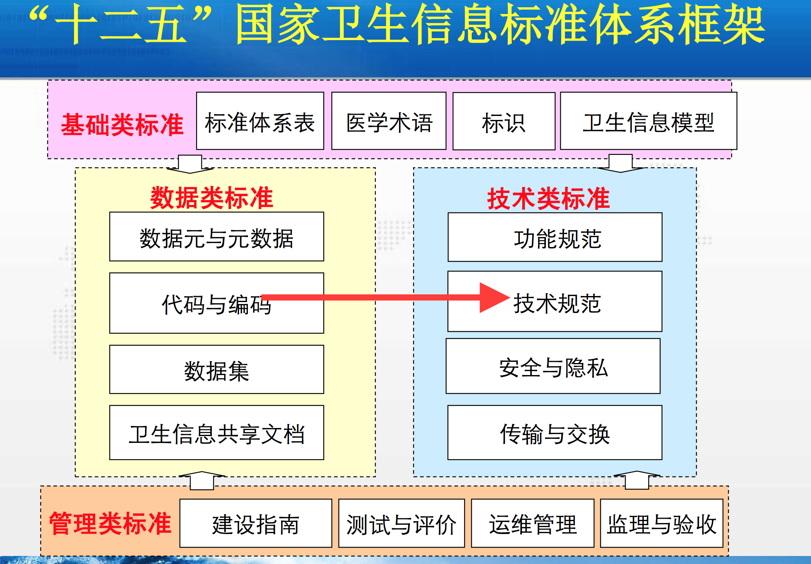

healthcaredatastandard
======================

## 概述

在09年新医改之后，国家层面上对卫生信息标准的重视程度也算是提高了，也有一些不错的进展，整体上还是偏慢，无法满足新形势下的医疗类应用和系统的开发。

目前国家层面上的卫生信息标准体系如下

目前已存在的数量  

| 年度  | 计划数 | 实际数 | 发布/报批数 | 送审数 | 正在研制数 |  
| ----  | ---- | ----  | ---- | ----  | ---- |   
2008  |     8  | 10  | 	10  | 	0  | 	0
2009  | 	7  | 	7  | 	7  | 	0  | 	0
2010  | 	8  | 	8  | 	8  | 	0  | 	0
2011  | 	108  | 	129  | 	126  | 	3  | 	0
2012  | 	7  | 	50  | 	49  | 	1  | 	0
2013  | 	22  | 	37  | 	17  | 	13  | 	7
2014  | 	7  | 	7  | 	0  | 	0  | 	7
2015  | 	20  | 	2  | 	0  | 	18  | 	/
2016  | 	13  | 	11  | 	0  | 	2  | 	87
2017  | 	5  | 	0  | 	5  | 	0  | 	18
2018  | 	  | 	  | 	  | 	  | 	  | 
合计| 283  | 	37  | 	5  | 	33  | 	209  | 

## 基础类

| 编号  | 名称 | 
| ----  | ---- | 
| WS/T 303-2009  | 卫生信息数据元标准化规则 | 
|  WS/T 304-2009  | 卫生信息数据模式描述指南 | 
|  WS/T 305-2009  | 卫生信息数据集元数据规范 | 
|  WS/T 306-2009  | 卫生信息数据集分类与编码规则 | 
|  WS/T 370-2012  | 卫生信息基本数据集编制规范 | 
|  WS/T 482-2016  | 卫生信息共享文档编制规范 | 

## 数据类
             
### 数据元

| 编号  | 名称 | 
| ----  | ---- | 
| WS 363-2011  | 卫生信息数据元目录 第1-17部分 | 
| WS 364-2011  | 卫生信息数据元值域代码 第1-17部分 | 

| 标准编号 |   标准中文名称 |  标识符范围 |  数据元数目 | 
| ----  | ---- |  ---- |  ---- | 
| WS363.1-2011| 卫生信息数据元目录第1部分:总则 	| 		| 	| 
| WS363.2-2011| 卫生信息数据元目录第2部分:标识	| DE01.00.001.00-DE01.00.015.00	| 13
| WS363.3-2011| 	卫生信息数据元目录第3部分:人口学及社会经济学特征	| DE02.01.001.00-DE02.01.058.00	| 62
| WS363.4-2011 |  	卫生信息数据元目录第4部分:健康史	| DE02.10.001.00-DE02.10.096.00	| 90
| WS363.5-2011 | 	卫生信息数据元目录第5部分:健康危险因素	| DE03.00.001.00-DE03.00.099.00	| 98
| WS363.6-2011 | 	卫生信息数据元目录第6部分:主诉与症状	| DE04.01.001.00-DE04.01.120.00	| 119
| WS363.7-2011 | 	卫生信息数据元目录第7部分:体格检查	| DE04.10.001.00-DE04.10.243.00	| 241
| WS363.8-2011 | 	卫生信息数据元目录第8部分:临床辅助检查	| DE04.30.001.00-DE04.30.051.00	| 51
| WS363.9-2011 | 	卫生信息数据元目录第9部分:实验室检查	| DE04.50.001.00-DE04.50.129.00	| 129
| WS363.10-2011| 	卫生信息数据元目录第10部分:医学诊断	| DE05.01.001.00-DE05.01.073.00	| 73
| WS363.11-2011	| 卫生信息数据元目录第11部分:医学评估	| DE05.10.001.00-DE05.10.128.00	| 127
| WS363.12-2011	| 卫生信息数据元目录第12部分:计划与干预	| DE06.00.001.00-DE06.00.177.00	| 175
| WS363.13-2011	| 卫生信息数据元目录第13部分:卫生费用	| DE07.00.001.00-DE07.00.010.00	| 10
| WS363.14-2011	| 卫生信息数据元目录第14部分:卫生机构	| DE08.10.001.00-DE08.10.053.00	| 53
| WS363.15-2011	| 卫生信息数据元目录第15部分:卫生人员	| DE08.30.001.00-DE08.30.031.00	| 31
| WS363.16-2011	| 卫生信息数据元目录第16部分:药品、设备与材料	| DE08.50.001.00-DE08.50.025.00	| 25
| WS363.17-2011	| 卫生信息数据元目录第17部分:卫生管理	| DE09.00.001.00-DE09.00.102.00	| 102

### 代码与编码

| 编号  | 名称 | 
| ----  | ---- | 
| WS 364-2011  | 卫生信息数据元值域代码 第1-17部分 | 
| WS xxx-2013  | 卫生统计指标目录 第1-10部分 | 
| GB/T 14396-2016疾病分类与代码  | 疾病分类与代码 | 
| WS 446-2014  |  居民健康档案医学检验项目常用代码 | 
| WS xxx-2013  |  医疗服务项目分类与编码 | 

### 数据集

| 编号  | 名称 | 性质 |  
| ----  | ---- |  ---- |      
| WS 365-2011  | 城乡居民健康档案基本数据集 | 
| WS 371-2012  | 基本信息基本数据集 个人信息 | 
| WS 372-2012  | 疾病管理基本数据集  第1-6部分 | 
| WS 373-2012  | 医疗服务基本数据集 第1-3部分 | 
| WS 374-2012  | 卫生管理基本数据集 第1-4部分 | 
| WS 375-2012  | 疾病控制基本数据集 第1-23部分 | 
| WS 376-2013  | 儿童保健基本数据集 第1-5部分 | 
| WS 377-2013  | 妇女保健基本数据集 第1-7部分 | 
| WS xxx-2013  | 卫生应急管理基本数据集 第1-5部分 | 
| WS 538-2017  | 医学数字影像通信基本数据集 | 强制性卫生行业标准    
| WS 539-2017  | 远程医疗信息基本数据集 | 强制性卫生行业标准     
| WS 540-2017  | 继续医学教育管理基本数据集 | 强制性卫生行业标准     
| WS 541-2017  | 新型农村合作医疗基本数据集 | 强制性卫生行业标准          
| WS 542-2017  | 院前医疗急救基本数据集 | 强制性卫生行业标准          
| WS 537-2017  | 居民健康卡数据集 | 强制性卫生行业标准       
| WS xxx-2013  | 居民健康卡注册管理信息系统基本数据集 | 

| 数据集名称	| 所属类别	| 所属标准编号	| 所属标准名称   |   
| ----  | ---- |  ---- |  ---- |       
| 个人基本信息	| 基本信息	| WS365	| 城乡居民健康档案基本数据集      | 
| 健康体检信息	| 健康体检	| WS365	| 城乡居民健康档案基本数据集      | 
| 新生儿家庭访视信息	| 儿童保健	| WS365	| 城乡居民健康档案基本数据集         | 
| 儿童健康检查信息	| 儿童保健	| WS365	| 城乡居民健康档案基本数据集       | 
| 产前随访服务信息	| 妇女保健	| WS365	| 城乡居民健康档案基本数据集     | 
| 产后访视服务信息	| 妇女保健	| WS365	| 城乡居民健康档案基本数据集      | 
| 产后42天健康体检信息	| 妇女保健	| WS365	| 城乡居民健康档案基本数据集|       
| 预防接种卡信息	| 疾病控制	| WS365	| 城乡居民健康档案基本数据集  |     
| 传染病报告卡信息	| 疾病控制	| WS365	| 城乡居民健康档案基本数据集| 
| 职业病报告卡信息	| 疾病控制	| WS365| 城乡居民健康档案基本数据集       |  
| 食源性疾病报告卡信息	| 疾病控制	| WS365	| 城乡居民健康档案基本数据集 |       
| 高血压患者随访信息	| 疾病管理	| WS365	| 城乡居民健康档案基本数据集 |      
| 2型糖尿病患者随访信息	| 疾病管理	| WS365	| 城乡居民健康档案基本数据集  |      
| 重性精神疾病患者管理信息	| 疾病管理	| WS365	| 城乡居民健康档案基本数据集   |        
| 门诊摘要信息	| 医疗服务	| WS365	| 城乡居民健康档案基本数据集   |    
| 住院摘要信息	| 医疗服务	| WS365	| 城乡居民健康档案基本数据集  |    
| 会诊信息	| 医疗服务	| WS365	| 城乡居民健康档案基本数据集      | 
| 转院(诊)信息	| 医疗服务	| WS365	| 城乡居民健康档案基本数据集  | 

强制性卫生行业标准         
         

| 标准编号 |   标准中文名称 | 数据元数目 | 性质 |  
| ----  | ---- |  ---- | ---- |  
| WS 371-2012 		| 基本信息基本数据集 个人信息		| 68
| WS 376.1-2013		| 儿童保健基本数据集 第1部分 出生医学证明		| 39
| WS 376.2-2013		| 儿童保健基本数据集 第2部分：儿童健康体检		| 61
| WS 376.3-2013		| 儿童保健基本数据集 第3部分：新生儿疾病筛查		| 41
| WS 376.4-2013		| 儿童保健基本数据集 第4部分：体弱儿童管理		| 33
| WS 376.5-2013		| 儿童保健基本数据集 第5部分：5岁以下儿童死亡报告		| 27
| WS 377.1-2013		| 妇女保健基本数据集 第1部分：婚前保健服务		| 122
| WS 377.2-2013		| 妇女保健基本数据集 第2部分 妇女病普查		| 74
| WS 377.3-2013		| 妇女保健基本数据集 第3部分计划生育技术服务		| 131
| WS 377.4-2013		| 妇女保健基本数据集 第4部分孕产期保健服务与高危管理		| 244
| WS 377.5-2013		| 妇女保健基本数据集 第5部分产前筛查与诊断		| 31
| WS 377.6-2013		| 妇女保健基本数据集 第6部分出生缺陷监测		| 48
| WS 377.7-2013		| 妇女保健基本数据集 第7部分孕产妇死亡报告		| 39
| WS 375.1-2012 	| 疾病控制基本数据集 第1部分：艾滋病综合防治		| 71
| WS 375.2-2012 	| 疾病控制基本数据集 第2部分：血吸虫病病人管理		| 115
| WS 375.3-2012		|  疾病控制基本数据集 第3部分：慢性丝虫病病人管理		| 73
| WS 375.4-2012	 	| 疾病控制基本数据集 第4部分：职业病报告		| 63
| WS 375.5-2012	    | 疾病控制基本数据集 第5部分：职业性健康监护		| 261
| WS 375.6-2012 	| 疾病控制基本数据集 第6部分：伤害监测报告		| 41
| WS 375.7-2012 	| 疾病控制基本数据集 第7部分：农药中毒报告		| 33
| WS 375.8-2012 	| 疾病控制基本数据集 第8部分：行为危险因素监测		| 56
| WS 375.9-2012 	| 疾病控制基本数据集 第9部分：死亡医学证明		| 49
| WS 375.10-2012 	| 疾病控制基本数据集 第10部分：传染病报告		| 33
| WS 375.11-2012 	| 疾病控制基本数据集 第11部分：结核病报告		| 78
| WS 375.12-2012 	| 疾病控制基本数据集 第12部分：预防接种		| 42    
| WS 375.13-2017 	| 疾病控制基本数据集 第13部分：职业病危害因素监测 |          
| WS 375.14-2016 	| 疾病控制基本数据集 第14部分：学校缺勤缺课监测报告 |          
| WS 375.15-2016 	| 疾病控制基本数据集 第15部分：托幼机构缺勤监测报告 |          
| WS 375.18-2016 	| 疾病控制基本数据集 第18部分：疑似预防接种异常反应报告 |          
| WS 375.19-2016 	| 疾病控制基本数据集 第19部分：疫苗管理 |        
| WS 375.20-2016 	| 疾病控制基本数据集 第20部分：脑卒中登记报告 |    
| WS 375.21-2016 	| 疾病控制基本数据集 第21部分：脑卒中病人管理 |    
| WS 375.22-2016 	| 疾病控制基本数据集 第22部分：宫颈癌筛查登记 |    
| WS 375.23-2016 	| 疾病控制基本数据集 第23部分：大肠癌筛查登记 |    
| WS 372.1-2012 	| 疾病管理基本数据集 第1部分：乙肝患者管理		| 106
| WS 372.2-2012		| 疾病管理基本数据集 第2部分：高血压患者健康管理	| 106
| WS 372.3-2012 	| 疾病管理基本数据集 第3部分：重性精神疾病患者管理		| 118
| WS 372.4-2012 	| 疾病管理基本数据集 第4部分：老年人健康管理		| 102
| WS 372.5-2012 	| 疾病管理基本数据集 第5部分：2型糖尿病患者健康管理		| 113
| WS 372.6-2012 	| 疾病管理基本数据集 第6部分：肿瘤病例管理		| 72
| WS 373.1-2012 	| 医疗服务基本数据集 第1部分：门诊摘要		| 62
| WS 373.2-2012 	| 医疗服务基本数据集 第2部分：住院摘要		| 72
| WS 373.3-2012	   | 医疗服务基本数据集 第3部分：成人健康体检		| 182
| WS 374.1-2012 		| 卫生管理基本数据集 第1部分：卫生监督检查与行政处罚		| 62
| WS 374.2-2012 		| 卫生管理基本数据集 第2部分：卫生监督行政许可与登记		|92
| WS 374.3-2012 		| 卫生管理基本数据集 第3部分：卫生监督监测与评价		|22
| WS 374.4-2012 		| 卫生管理基本数据集 第4部分：卫生监督机构与人员		|105

| 标准编号 |   标准中文名称 | 数据元数目 | 性质 | 
| ----  | ---- |  ---- | ---- |     
| WS 445.1-2014 		| 电子病历基本数据集 第1部分：病历概要  		|  xx               
| WS 445.2-2014 		| 电子病历基本数据集 第2部分：门（急）诊病历  		|  xx               
| WS 445.3-2014 		| 电子病历基本数据集 第3部分：门（急）诊处方  		|  xx               
| WS 445.4-2014 		| 电子病历基本数据集 第4部分：检查检验记录  		|  xx               
| WS 445.5-2014 		| 电子病历基本数据集 第5部分：一般治疗处置记录  		|  xx               
| WS 445.6-2014 		| 电子病历基本数据集 第6部分：助产记录  		|  xx               
| WS 445.7-2014 		| 电子病历基本数据集 第7部分：护理操作记录  		|  xx               
| WS 445.8-2014 		| 电子病历基本数据集 第8部分：护理评估与计划  		|  xx               
| WS 445.9-2014 		| 电子病历基本数据集 第9部分：知情告知信息  		|  xx               
| WS 445.10-2014 		| 电子病历基本数据集 第10部分：住院病案首页  		|  xx               
| WS 445.11-2014 		| 电子病历基本数据集 第11部分：中医住院病案首页  		|  xx               
| WS 445.12-2014 		| 电子病历基本数据集 第12部分：入院记录  		|  xx               
| WS 445.13-2014 		| 电子病历基本数据集 第13部分：住院病程记录  		|  xx               
| WS 445.14-2014 		| 电子病历基本数据集 第14部分：住院医嘱  		|  xx               
| WS 445.15-2014 		| 电子病历基本数据集 第15部分：出院小结  		|  xx               
| WS 445.16-2014 		| 电子病历基本数据集 第16部分：转诊(院)记录  		|  xx               
| WS 445.17-2014 		| 电子病历基本数据集 第17部分：医疗机构信息  		|  xx               

### 共享文档

## 技术类

### 功能规范

| 编号  | 名称 | 
| ----  | ---- | 
| WS/T 452-2014  | 卫生监督信息系统功能规范 | 
| WS/T xxx-2013  | 妇幼保健信息系统基本功能规范 | 
| WS/T xxx-2013  | 基层医疗卫生信息系统功能规范 | 
| WS/T 451-2014  | 院前医疗急救指挥信息系统基本功能规范 | 
| WS/T 450-2014  | 新型农村合作医疗信息系统基本功能规范 | 
| WS/T 449-2014  | 慢性病监测信息系统基本功能规范 | 
| WS/T 529-2016  | 远程医疗信息系统基本功能规范 | 推荐性卫生行业标准 |
| WS/T xxx-2013  | 免疫规划信息系统基本功能规范(征求意见稿) | 
| WS/T 547-2017  | 医院感染管理信息系统基本功能规范 | 推荐性卫生行业标准 |

### 技术规范

| 编号  | 名称 |  性质 | 
| ----  | ---- |   ---- |    
| WS/T 448-2014  | 基于健康档案的区域卫生信息平台技术规范 | 
| WS/T 447-2014  | 基于电子病历的医院信息平台技术规范 | 
| WS/T 545-2017  | 远程医疗信息系统技术规范 | 推荐性卫生行业标准 |
| WS/T 546-2017  | 远程医疗信息系统与统一通信平台交互规范 | 推荐性卫生行业标准 |
| WS/T 526-2016  | 妇幼保健服务信息系统技术规范 | 推荐性卫生行业标准 |
| WS/T 544-2017  | 医学数字影像中文封装与通信规范 | 推荐性卫生行业标准 |    
| WS/T 548-2017  | 医学数字影像通信（DICOM）中文标准符合性测试规范 | 推荐性卫生行业标准 |    
| WS/T xxx-2013  | 区域疾病控制业务应用子平台技术规范 | 推荐性卫生行业标准 |
| WS/T 517-2016  | 基层医疗卫生信息系统技术规范 | 推荐性卫生行业标准 |
| WS/T xxx-2013  | 远程医疗设备及统一通讯交互规范(征求意见稿) |  |
| WS/T xxx-2013  | 区域卫生信息平台交互规范(征求意见稿) |  |
| WS/T xxx-2013  | 医院信息平台交互规范(征求意见稿) |  |          
| WS/T 543.1-2017  | 居民健康卡技术规范 第1部分：总则 | 推荐性卫生行业标准 |            
| WS/T 543.2-2017  | 居民健康卡技术规范 第2部分：用户卡技术规范 | 推荐性卫生行业标准 |            
| WS/T 543.3-2017  | 居民健康卡技术规范 第3部分：用户卡应用规范 | 推荐性卫生行业标准 |            
| WS/T 543.4-2017  | 居民健康卡技术规范 第4部分：用户卡命令集 | 推荐性卫生行业标准 |            
| WS/T 543.5-2017  | 居民健康卡技术规范 第5部分：终端技术规范 | 推荐性卫生行业标准 |            
| WS/T 543.6-2017  | 居民健康卡技术规范 第6部分：用户卡及终端产品检测规范 | 推荐性卫生行业标准 |            

### 安全与隐私

### 传输与交换

| 编号  | 名称 |  性质 | 
| ----  | ---- |  ---- | 
| WS/T 483.1-2016  | 健康档案共享文档规范 第1部分：个人基本健康信息登记 | 推荐性卫生行业标准 |            
| WS/T 483.2-2016  | 健康档案共享文档规范 第2部分：出生医学证明 | 推荐性卫生行业标准 |            
| WS/T 483.3-2016  | 健康档案共享文档规范 第3部分：新生儿家庭访视 | 推荐性卫生行业标准 |            
| WS/T 483.4-2016  | 健康档案共享文档规范 第4部分：儿童健康体检 | 推荐性卫生行业标准 |            
| WS/T 483.5-2016  | 健康档案共享文档规范 第5部分：首次产前随访服务 | 推荐性卫生行业标准 |            
| WS/T 483.6-2016  | 健康档案共享文档规范 第6部分：产前随访服务 | 推荐性卫生行业标准 |            
| WS/T 483.7-2016  | 健康档案共享文档规范 第7部分：产后访视 | 推荐性卫生行业标准 |            
| WS/T 483.8-2016  | 健康档案共享文档规范 第8部分：产后42天健康检查 | 推荐性卫生行业标准 |            
| WS/T 483.9-2016  | 健康档案共享文档规范 第9部分：预防接种报告 | 推荐性卫生行业标准 |  
| WS/T 483.10-2016  | 健康档案共享文档规范 第10部分：传染病报告 | 推荐性卫生行业标准 |            
| WS/T 483.11-2016  | 健康档案共享文档规范 第11部分：死亡医学证明 | 推荐性卫生行业标准 |            
| WS/T 483.12-2016  | 健康档案共享文档规范 第12部分：高血压患者随访服务 | 推荐性卫生行业标准 |            
| WS/T 483.13-2016  | 健康档案共享文档规范 第13部分：2型糖尿病患者随访服务 | 推荐性卫生行业标准 |            
| WS/T 483.14-2016  | 健康档案共享文档规范 第14部分：重性精神疾病患者个人信息登记 | 推荐性卫生行业标准 |            
| WS/T 483.15-2016  | 健康档案共享文档规范 第15部分：重性精神疾病患者随访服务 | 推荐性卫生行业标准 |            
| WS/T 483.16-2016  | 健康档案共享文档规范 第16部分：成人健康体检 | 推荐性卫生行业标准 |            
| WS/T 483.17-2016  | 健康档案共享文档规范 第17部分：门诊摘要 | 推荐性卫生行业标准 |            
| WS/T 483.18-2016  | 健康档案共享文档规范 第18部分：住院摘要 | 推荐性卫生行业标准 |            
| WS/T 483.19-2016  | 健康档案共享文档规范 第19部分：会诊记录 | 推荐性卫生行业标准 |            
| WS/T 483.20-2016  | 健康档案共享文档规范 第20部分：转诊(院)记录 | 推荐性卫生行业标准 |            

| 编号  | 名称 |  性质 | 
| ----  | ---- |  ---- | 
| WS/T 500.1-2016  | 电子病历共享文档规范 第1部分：病历概要 | 推荐性卫生行业标准 |            
| WS/T 500.2-2016  | 电子病历共享文档规范 第2部分：门(急)诊病历 | 推荐性卫生行业标准 |            
| WS/T 500.3-2016  | 电子病历共享文档规范 第3部分：急诊留观病历 | 推荐性卫生行业标准 |            
| WS/T 500.4-2016  | 电子病历共享文档规范 第4部分：西药处方 | 推荐性卫生行业标准 |            
| WS/T 500.5-2016  | 电子病历共享文档规范 第5部分：中药处方 | 推荐性卫生行业标准 |            
| WS/T 500.6-2016  | 电子病历共享文档规范 第6部分：检查报告 | 推荐性卫生行业标准 |            
| WS/T 500.7-2016  | 电子病历共享文档规范 第7部分：检验报告 | 推荐性卫生行业标准 |            
| WS/T 500.8-2016  | 电子病历共享文档规范 第8部分：治疗记录 | 推荐性卫生行业标准 |            
| WS/T 500.9-2016  | 电子病历共享文档规范 第9部分：一般手术记录 | 推荐性卫生行业标准 |            
| WS/T 500.10-2016  | 电子病历共享文档规范 第10部分：麻醉术前访视记录 | 推荐性卫生行业标准 |            
| WS/T 500.11-2016  | 电子病历共享文档规范 第11部分：麻醉记录 | 推荐性卫生行业标准 |            
| WS/T 500.12-2016  | 电子病历共享文档规范 第12部分：麻醉术后访视记录 | 推荐性卫生行业标准 |            
| WS/T 500.13-2016  | 电子病历共享文档规范 第13部分：输血记录 | 推荐性卫生行业标准 |            
| WS/T 500.14-2016  | 电子病历共享文档规范 第14部分：待产记录 | 推荐性卫生行业标准 |            
| WS/T 500.15-2016  | 电子病历共享文档规范 第15部分：阴道分娩记录 | 推荐性卫生行业标准 |            
| WS/T 500.16-2016  | 电子病历共享文档规范 第16部分：剖宫产记录 | 推荐性卫生行业标准 |            
| WS/T 500.17-2016  | 电子病历共享文档规范 第17部分：一般护理记录 | 推荐性卫生行业标准 |            
| WS/T 500.18-2016  | 电子病历共享文档规范 第18部分：病重（病危）护理记录 | 推荐性卫生行业标准 |            
| WS/T 500.19-2016  | 电子病历共享文档规范 第19部分：手术护理记录 | 推荐性卫生行业标准 |            
| WS/T 500.20-2016  | 电子病历共享文档规范 第20部分：生命体征测量记录 | 推荐性卫生行业标准 |            
| WS/T 500.21-2016  | 电子病历共享文档规范 第21部分：出入量记录 | 推荐性卫生行业标准 |            
| WS/T 500.22-2016  | 电子病历共享文档规范 第22部分：高值耗材使用记录 | 推荐性卫生行业标准 |            
| WS/T 500.23-2016  | 电子病历共享文档规范 第23部分：入院评估 | 推荐性卫生行业标准 |            
| WS/T 500.24-2016  | 电子病历共享文档规范 第24部分：护理计划 | 推荐性卫生行业标准 |            
| WS/T 500.25-2016  | 电子病历共享文档规范 第25部分：出院评估与指导 | 推荐性卫生行业标准 |            
| WS/T 500.26-2016  | 电子病历共享文档规范 第26部分：手术知情同意书 | 推荐性卫生行业标准 |            
| WS/T 500.27-2016  | 电子病历共享文档规范 第27部分：麻醉知情同意书 | 推荐性卫生行业标准 |            
| WS/T 500.28-2016  | 电子病历共享文档规范 第28部分：输血治疗同意书 | 推荐性卫生行业标准 |            
| WS/T 500.29-2016  | 电子病历共享文档规范 第29部分：特殊检查及特殊治疗同意书 | 推荐性卫生行业标准 |            
| WS/T 500.30-2016  | 电子病历共享文档规范 第30部分：病危(重)通知书 | 推荐性卫生行业标准 |            
| WS/T 500.31-2016  | 电子病历共享文档规范 第31部分：其他知情告知同意书 | 推荐性卫生行业标准 |            
| WS/T 500.32-2016  | 电子病历共享文档规范 第32部分：住院病案首页 | 推荐性卫生行业标准 |            
| WS/T 500.33-2016  | 电子病历共享文档规范 第33部分：中医住院病案首页 | 推荐性卫生行业标准 |            
| WS/T 500.34-2016  | 电子病历共享文档规范 第34部分：入院记录 | 推荐性卫生行业标准 |            
| WS/T 500.35-2016  | 电子病历共享文档规范 第35部分：24小时内入出院记录 | 推荐性卫生行业标准 |            
| WS/T 500.36-2016  | 电子病历共享文档规范 第36部分：24小时内入院死亡记录 | 推荐性卫生行业标准 |            
| WS/T 500.37-2016  | 电子病历共享文档规范 第37部分：住院病程记录  首次病程记录 | 推荐性卫生行业标准 |            
| WS/T 500.38-2016  | 电子病历共享文档规范 第38部分：住院病程记录  日常病程记录 | 推荐性卫生行业标准 |            
| WS/T 500.39-2016  | 电子病历共享文档规范 第39部分：住院病程记录  上级医师查房记录 | 推荐性卫生行业标准 |            
| WS/T 500.40-2016  | 电子病历共享文档规范 第40部分：住院病程记录  疑难病例讨论记录 | 推荐性卫生行业标准 |            
| WS/T 500.41-2016  | 电子病历共享文档规范 第41部分：住院病程记录  交接班记录 | 推荐性卫生行业标准 |            
| WS/T 500.42-2016  | 电子病历共享文档规范 第42部分：住院病程记录 转科记录 | 推荐性卫生行业标准 |            
| WS/T 500.43-2016  | 电子病历共享文档规范 第43部分：住院病程记录 阶段小结 | 推荐性卫生行业标准 |            
| WS/T 500.44-2016  | 电子病历共享文档规范 第44部分：住院病程记录 抢救记录 | 推荐性卫生行业标准 |            
| WS/T 500.45-2016  | 电子病历共享文档规范 第45部分：住院病程记录 会诊记录 | 推荐性卫生行业标准 |            
| WS/T 500.46-2016  | 电子病历共享文档规范 第46部分：住院病程记录 术前小结 | 推荐性卫生行业标准 |           
| WS/T 500.47-2016  | 电子病历共享文档规范 第47部分：住院病程记录 术前讨论 | 推荐性卫生行业标准 |            
| WS/T 500.48-2016  | 电子病历共享文档规范 第48部分：住院病程记录术后 首次病程记录 | 推荐性卫生行业标准 |            
| WS/T 500.49-2016  | 电子病历共享文档规范 第49部分：住院病程记录 出院记录 | 推荐性卫生行业标准 |            
| WS/T 500.50-2016  | 电子病历共享文档规范 第50部分：住院病程记录 死亡记录 | 推荐性卫生行业标准 |            
| WS/T 500.51-2016  | 电子病历共享文档规范 第51部分：住院病程记录 死亡病例讨论记录 | 推荐性卫生行业标准 |            
| WS/T 500.52-2016  | 电子病历共享文档规范 第52部分：住院医嘱 | 推荐性卫生行业标准 |            
| WS/T 500.53-2016  | 电子病历共享文档规范 第53部分：出院小结 | 推荐性卫生行业标准 |            
          

## 管理类

### 建设指南

| 编号  | 名称 | 
| ----  | ---- | 
| WS/T xxx-2009  | 综合卫生管理信息平台建设指南（征求意见稿） | 

### 测试与评价

| 编号  | 名称 | 
| ----  | ---- | 
| WS/T 502-2016  | 电子健康档案与区域卫生信息平台标准符合性测试规范 | 
| WS/T 501-2016  | 电子病历与医院信息平台标准符合性测试规范 | 

### 运维管理

### 监理与验收

## 参考          

1、[国家卫生信息标准与实施评价 汤学军 CHINC2015]()       

2、[中国卫生信息标准网](http://www.chiss.org.cn/hism/wcmpub/hism1029/index/)    

3、[统计信息中心](http://www.moh.gov.cn/mohwsbwstjxxzx/s2907/new_list.shtml)     

## 更新日志

2018-04-28日更新

详情请参考本次所的readme文件
主要是增加了2016 17 年发布的一些标准文件
修正了原来表格展示的问题 

2017-03-07日更新
1.对于 README.md 中的标准编号进行了更新          
参考国卫通[2016]12号    

2014-11-13日更新
1.对于 "数据集标准/Excel/WS365城乡居民健康档案基本数据集.xlsx"      
* 5.2.03新生儿家庭访视信息第56行 HDSD00.01,261 修改为 5.2.03新生儿家庭访视信息第56行 HDSD00.01.261(逗号改为点)       
* 5.2.01个人基本信息 第二行为空行 移除       
* 5.2.04儿童健康检查信息 第一列删除 与其他表单保持格式一致        
* 5.2.09传染病报告卡信息第23行 Hr)SD00.01.379  修改为 5.2.09传染病报告卡信息第23行 HDSD00.01.379                 
* 5.2.09传染病报告卡信息第33行 HDSD00. 01.407 修改为 5.2.09传染病报告卡信息第33行 HDSD00.01.407(00.01.407 原来01前面有空格)     
* 5.2.09传染病报告卡信息第38行 HDSD00. 01.412 修改为 5.2.09传染病报告卡信息第38行 HDSD00.01.412 (00.01.412原来01前面有空格)      
* 5.2.18转诊(院)信息第49行 HDSD00,01.571 修改为 5.2.18转诊(院)信息第49行 HDSD00.01.571(逗号改为点)      
2.对于"WS369-375卫生信息基本数据集.xlsx"      
* 儿童保健基本数据集 第2部分 儿童健康体检第62行 29  删除第62行                
* 疾病管理基本数据集 第1部分 乙肝患者管理第37行 HDSB04,01.037 修改为 疾病管理基本数据集 第1部分 乙肝患者管理第37行 HDSB04.01.037(逗号改为点)     
* 疾病管理基本数据集 第1部分 乙肝患者管理第97行  HDSB04,01.097  修改为   HDSB04.01.097  (逗号改为点)       
* 疾病管理基本数据集 第4部分 老年人健康管理第90行  HDSB04,04.090 修改为  HDSB04.04.090       
* 疾病管理基本数据集 第6部分 肿瘤病例管理第30行  HDSB04,06.030 修改为  HDSB04.06.030     
* 疾病管理基本数据集 第6部分 肿瘤病例管理第61行  HDSB04.06.06] 修改为  HDSB04.06.061(拿掉] )       
3.对于"数据元标准/Excel/卫生信息数据元目录.xlsx"          

